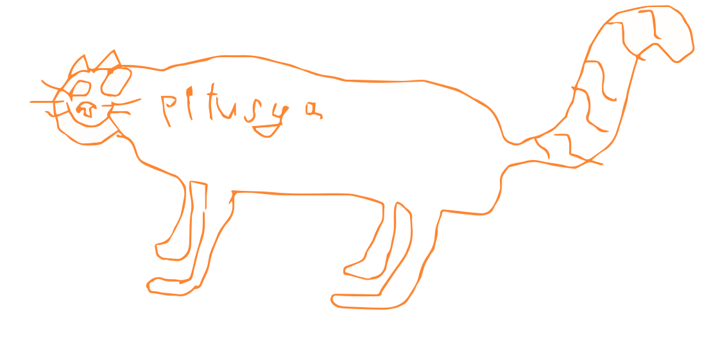

<p align="center">
  
</p>

# The Pitusya Programming Language

## Overview
The language with no superpowers (no standard library, only one type - a 64 bit width floating point number).

## Syntax
```pitusya
fn slowInverseSquareRoot(x) {
    ret 1 / x * x;
}
fn main() {
    ret slowInverseSquareRoot(4;);
}
```
Mind the second semicolon in arguments passing!

A bit complicated example:
```pitusya
fn complex(a b c) {
    ret a * b / (c * a) + (c / 8) * (a * a);
}
fn main() {
    ret complex(11;15;14;);
}
```